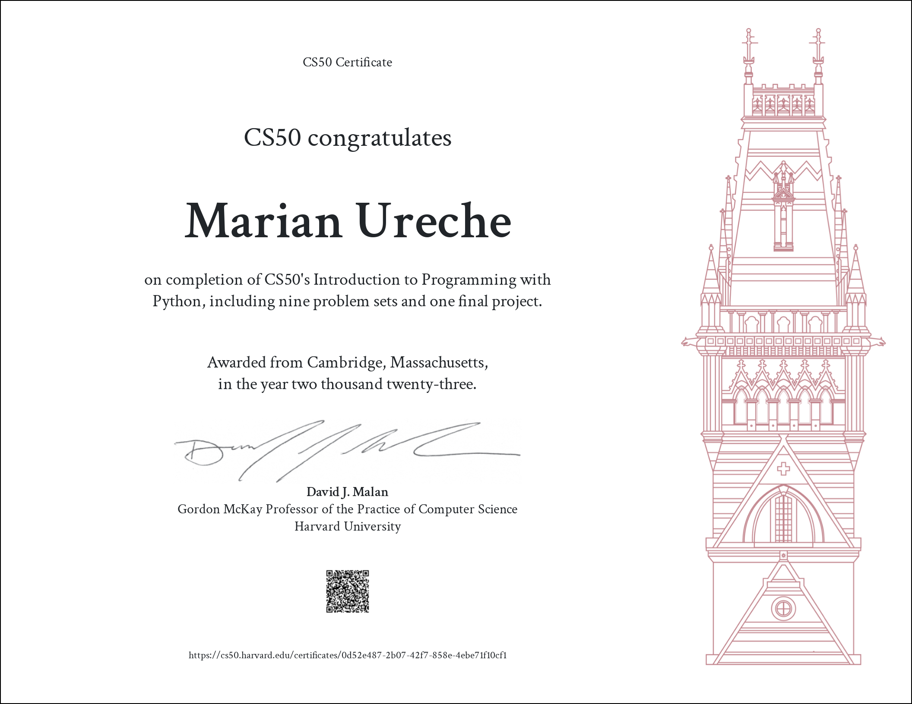

# [CS50’s Introduction to Programming with Python](https://cs50.harvard.edu/python/2022/)

Problem sets with my solutions for [CS50's Introduction to Programming with Python](https://cs50.harvard.edu/python/2022/) aka CS50P.

[[Week 0] - Functions, Variables](https://cs50.harvard.edu/python/2022/weeks/0/)

[[Week 1] - Conditionals](https://cs50.harvard.edu/python/2022/weeks/1/)

[[Week 2] - Loops](https://cs50.harvard.edu/python/2022/weeks/2/)

[[Week 3] - Exceptions](https://cs50.harvard.edu/python/2022/weeks/3/)

[[Week 4] - Libraries](https://cs50.harvard.edu/python/2022/weeks/4/)

[[Week 5] - Unit Tests](https://cs50.harvard.edu/python/2022/weeks/5/)

[[Week 6] - File I/O](https://cs50.harvard.edu/python/2022/weeks/6/)

[[Week 7] - Regular Expressions](https://cs50.harvard.edu/python/2022/weeks/7/)

[[Week 8] - Object-Oriented Programming](https://cs50.harvard.edu/python/2022/weeks/8/)

[[Week 9] - Et Cetera](https://cs50.harvard.edu/python/2022/weeks/9/)

## Disclaimer:

### The following codes are for educational purpose only and not intended to be used / submitted as your own solutions.
### **Cheating violates the [Academic Honesty](https://cs50.harvard.edu/python/2022/honesty/) of the course, not to mention it's totally pointless if you actually want to learn programming.**

## Certificate:

